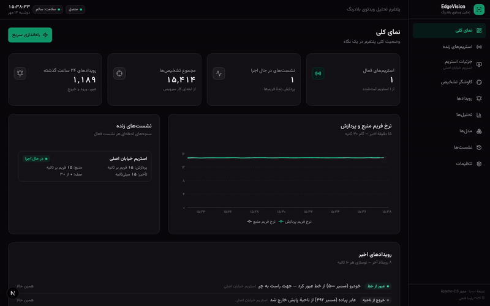

# اج‌ویژن — پلتفرم تحلیل ویدئوی بلادرنگ

اج‌ویژن (EdgeVision) نسخهٔ ۱٫۰٫۰ یک پلتفرم تحلیل ویدئوی بلادرنگ با رابط فارسی و راست‌به‌چپ است که همه‌چیزش در یک مخزن و روی یک ماشین اجرا می‌شود: موتور پردازش به زبان C++20، سرویس هماهنگی، API وب، داشبورد و دیتابیس SQLite. نسخهٔ ۱٫۰٫۰ برای استقرار تک‌کاربره و محلی ساخته شده است.

## اج‌ویژن چیست؟

اج‌ویژن استریم‌های ویدئویی را می‌گیرد، اشیا را تشخیص و ردیابی می‌کند، رویدادهای هندسی (عبور از خط، ورود و خروج از ناحیه) را می‌سازد و نتیجه را هم زنده روی داشبورد نشان می‌دهد و هم در دیتابیس نگه می‌دارد تا بعداً کاوش و تحلیل شود.

دو نکته را از همان ابتدا صادقانه بگوییم:

- **ورودی ویدئو در این نسخه سنتزی است.** به‌جای دوربین یا فایل ویدئویی، یک شبیه‌ساز صحنهٔ قطعی (deterministic) در موتور بومی صحنه‌هایی مثل خیابان دوطرفه یا چهارراه می‌سازد. انتزاع «منبع ویدئو» در موتور وجود دارد، اما هیچ بک‌اند ضبط واقعی (OpenCV/FFmpeg) همراه پروژه توزیع نمی‌شود.
- **موتور بومی واقعی است.** پردازش هر فریم — تشخیص، ردیابی، رویدادها و اندازه‌گیری کارایی — واقعاً در یک فرایند C++20 انجام می‌شود و همهٔ سنجه‌ها (تأخیر، FPS، CPU، حافظه) اندازه‌گیری واقعیِ همین خط‌لوله‌اند. گام «استنتاج» یک آشکارساز شبکه‌ای قطعی است که جانشین مدل ONNX قرار گرفته است؛ وزن ONNX توزیع نمی‌شود.

## چه مسئله‌ای را حل می‌کند؟

پایش ویدئویی سنتی یا دوربین‌محور است یا به ابر وابسته. اج‌ویژن مسیر سومی را نشان می‌دهد: یک استک کامل تحلیل بلادرنگ که روی یک ماشین لینوکسی و بدون هیچ سرویس ابری اجرا می‌شود، داده‌ها را همان‌جا نگه می‌دارد و رابط کاربری‌اش فارسی است. برای توسعه‌دهنده‌ای که می‌خواهد خط‌لولهٔ تشخیص/ردیابی/رویداد را با پارامترهای واقعی (شبکهٔ استنتاج، ظرفیت صف، آستانهٔ اطمینان) بشناسد و رفتارش را زیر بار ببیند، این پروژه یک صفحهٔ کارگاهی کامل است.

## ویژگی‌ها

- موتور بومی C++20 بدون هیچ وابستگی خارجی؛ کامپایل با یک اسکریپت (`bash scripts/build-engine.sh`)
- یک فرایند جداگانه به‌ازای هر نشست استریم؛ خرابی یک استریم بقیهٔ سیستم را سالم نگه می‌دارد
- آشکارساز شبکه‌ای با مؤلفه‌های همبند، ردیاب IoU (minHits ۳، maxAge ۱۲، minIoU ۰٫۳) و رویدادهای هندسی با هیسترزیس
- سنجه‌های واقعی در هر ثانیه: FPS منبع و پردازش، تأخیر avg/min/max/P50/P95، عمق صف، فریم‌های دورریخته، CPU و حافظهٔ فرایند موتور
- وضعیت نشست با هیسترزیس: RUNNING و DEGRADED (افت بیش از ۴۰٪ سرعت پردازش به‌مدت ۵ ثانیه)
- داشبورد فارسی RTL با ۹ نما: نمای کلی، استریم‌های زنده، جزئیات استریم، کاوشگر تشخیص، رویدادها، تحلیل‌ها، مدل‌ها، نشست‌ها و تنظیمات
- صحنهٔ زندهٔ SVG با جعبه‌های تشخیص، برچسب کلاس، ناحیهٔ پایش و خط عبور
- WebSocket بلادرنگ (socket.io) با اتصال مجدد و عضویت مجدد خودکار در اتاق استریم‌ها
- تاریخ جلالی، ارقام فارسی و فونت وزیرمتن در همهٔ داشبورد
- API کامل REST (`/api/v1/*`) با پیام‌های خطای فارسی و پاکت خطای یکدست
- خروجی CSV با BOM که در اکسل فارسی درست باز می‌شود
- نگهداشت دادهٔ خودکار: سنجه‌ها ۲۴ ساعت، تشخیص‌ها تا ۱۰۰ هزار ردیف، رویدادها تا ۲۰ هزار ردیف
- کلاینت Flutter و سرویس مرجع FastAPI در همان مخزن (اختیاری)

## معماری در یک نگاه

چهار لایه با یک دیتابیس SQLite همکاری می‌کنند:

| لایه | فناوری | نقش |
|---|---|---|
| موتور بومی | C++20 | تولید صحنه، تشخیص، ردیابی، رویدادها، سنجه‌ها؛ NDJSON روی stdout و فرمان روی stdin |
| سرویس موتور | Bun + TypeScript (پورت ۳۰۰۳) | راه‌اندازی فرایند موتور به‌ازای هر نشست، تنها نویسندهٔ دیتابیس، انتشار رویدادهای زنده روی socket.io |
| API وب | Next.js route handlers (پورت ۳۰۰۰) | خواندن با Prisma، اعتبارسنجی و هدایت نوشتن‌ها به سرویس موتور |
| داشبورد | Next.js 16 + React 19 | رابط فارسی RTL، نمودارها، صحنهٔ زنده |

نمودار کامل در [../assets/architecture.svg](../assets/architecture.svg) و شرح تفصیلی در [ARCHITECTURE_FA.md](ARCHITECTURE_FA.md) آمده است.

## ساختار مخزن

| مسیر | محتوا |
|---|---|
| `engine-cpp/` | موتور بومی C++20، CMakeLists.txt و ابزار تست |
| `mini-services/engine-service/` | سرویس هماهنگی موتور (Bun، پورت ۳۰۰۳) |
| `src/app/api/v1/` | لایهٔ API استراحت (Next.js) |
| `src/components/edgevision/` | نماها و اجزای داشبورد |
| `src/lib/edgevision/` | کلاینت API، سوکت، انواع و قالب‌بندی فارسی |
| `prisma/schema.prisma` | اسکیمای دیتابیس |
| `scripts/build-engine.sh` | اسکریپت کامپایل موتور |
| `docs/` | مستندات انگلیسی |
| `docs/fa/` | مستندات فارسی (همین مجموعه) |
| `docs/assets/` | نمودارها و اسکرین‌شات‌ها |
| `mobile/` | کلاینت Flutter |
| `services/api-python/` | سرویس مرجع FastAPI |
| `.github/` | قالب‌ها و گردش‌کارهای CI |

## راه‌اندازی سریع (کلون تا داشبورد زنده)

پیش‌نیازها و ریز جزئیات و رفع اشکال در [INSTALLATION_FA.md](INSTALLATION_FA.md) آمده است. مسیر کامل از صفر:

```bash
# ۰) دریافت مخزن
git clone https://github.com/ParsaFathii/EdgeVision.git
cd EdgeVision

# ۱) قالب متغیرهای محیطی را کپی کنید (مسیر پیش‌فرض SQLite: db/custom.db)
cp .env.example .env

# ۲) وابستگی‌های اپ
bun install

# ۳) اعمال اسکیمای دیتابیس (SQLite در db/custom.db)
bun run db:push

# ۴) کامپایل موتور بومی (خروجی: engine-cpp/build/edgevision-engine)
bash scripts/build-engine.sh

# ۵) اجرای سرویس موتور (ترمینال جداگانه، پورت ۳۰۰۳)
cd mini-services/engine-service
bun install
bun run dev

# ۶) اجرای داشبورد و API (ترمینال جداگانه، از ریشهٔ مخزن، پورت ۳۰۰۰)
cd ../..
bun run dev
```

سپس `http://localhost:3000` را باز کنید. در نمای کلی، دکمهٔ «راه‌اندازی سریع» یک استریم واقعی می‌سازد و همان لحظه اجرایش را آغاز می‌کند؛ صحنهٔ زندهٔ آن (جعبه‌های تشخیص، ناحیهٔ پایش و خط عبور) در [گیف نمایشی پایین همین صفحه](#گیف-نمایشی) قابل مشاهده است.

### پورت‌ها و نشانی‌ها

| نشانی | سرویس |
|---|---|
| `http://localhost:3000` | داشبورد و API عمومی (`/api/v1/*`) |
| `http://localhost:3003` | سرویس موتور: WebSocket (مسیر `/`) و API داخلی (`/internal/*` با توکن) |
| `db/custom.db` | دیتابیس SQLite (همهٔ داده‌ها) |
| `engine-cpp/build/edgevision-engine` | باینری موتور بومی |

لاگ‌ها: `dev.log` در ریشهٔ مخزن برای اپ و `mini-services/engine-service/service.log` برای سرویس موتور.

## چه چیز واقعی است و چه چیز جانشین

این بخش عمداً رک است:

1. **ورودی ویدئو سنتزی است.** شبیه‌ساز صحنه جای دوربین/فایل/شبکه را گرفته است. انتزاع منبع در موتور هست اما بک‌اند ضبط واقعی همراه ندارد.
2. **استنتاج، آشکارساز شبکه‌ای قطعی است** که در موتور بومی پیاده شده و جانشین مدل ONNX است. هیچ وزن ONNX توزیع نمی‌شود و رجیستری مدل‌ها فقط فرادادهٔ پیکربندی نگه می‌دارد.
3. **سنجه‌ها واقعی‌اند اما صحنه سنتزی است.** FPS، تأخیر، CPU و حافظه اندازه‌گیری واقعیِ خط‌لوله‌اند؛ خط‌لوله‌ای که صحنهٔ سنتزی را پردازش می‌کند.
4. **سرویس FastAPI در `services/api-python/` یک پیاده‌سازی مرجع قابل اجراست** از همان API روی همان دیتابیس؛ API اصلیِ سرویس‌دهی در این استقرار، لایهٔ route های Next.js است.

## وضعیت تست‌ها

- کامپایل موتور با سیاست «صفر هشدار» انجام می‌شود (`-Wall -Wextra -Wconversion -Wshadow -Werror`)؛ همین قواعد در بیلد sanitizer (ASan+UBSan) هم اعمال می‌شود.
- هارنس تست موتور با `python3 engine-cpp/tools/engine_smoke.py` اجرا می‌شود (در گردش‌کار توسعه سه‌بار پشت‌سرهم).
- داشبورد با `bun run lint` بدون هیچ خطا و هشداری پاس می‌شود و چک‌لیست دستی مرورگر (شروع/توقف، صحنهٔ زنده، فیلترها، CSV) روی خود اپ اجرا شده است.
- رفتارهای خرابی عمداً آزموده شده‌اند: قطع سرویس پردازش، موتور ناموجود (پاسخ ۵۰۳) و کرش فرایند موتور (نشست با reason واقعی ثبت می‌شود).

## مستندات

| فارسی | انگلیسی |
|---|---|
| [README_FA.md](README_FA.md) | [../README.md](../README.md) |
| [INSTALLATION_FA.md](INSTALLATION_FA.md) | [../INSTALLATION.md](../INSTALLATION.md) |
| [USER_GUIDE_FA.md](USER_GUIDE_FA.md) | [../USER_GUIDE.md](../USER_GUIDE.md) |
| [ARCHITECTURE_FA.md](ARCHITECTURE_FA.md) | [../ARCHITECTURE.md](../ARCHITECTURE.md) |
| [API_FA.md](API_FA.md) | [../API.md](../API.md) |
| [MODELS_FA.md](MODELS_FA.md) | [../MODELS.md](../MODELS.md) |
| [DEVELOPMENT_FA.md](DEVELOPMENT_FA.md) | [../DEVELOPMENT.md](../DEVELOPMENT.md) |
| [COPYRIGHT_FA.md](COPYRIGHT_FA.md) | [../COPYRIGHT.md](../COPYRIGHT.md) |

## اسکرین‌شات‌ها

تصویرهای واقعی از اپ در حال اجرا:

- [نمای کلی](../assets/screenshots/overview.png)
- [استریم‌های زنده](../assets/screenshots/streams.png)
- [جزئیات استریم و صحنهٔ زنده](../assets/screenshots/stream-detail-live.png)
- [کاوشگر تشخیص](../assets/screenshots/detections.png)
- [رویدادها](../assets/screenshots/events.png)
- [تحلیل‌ها](../assets/screenshots/analytics.png)
- [مدل‌ها](../assets/screenshots/models.png)
- [نشست‌ها](../assets/screenshots/sessions.png)
- [تنظیمات](../assets/screenshots/settings.png)

## گیف نمایشی



این گیف (~۳۰ ثانیه) مستقیم از اپ در حال اجرا ضبط شده است: نمای کلی، فهرست استریم‌ها، صحنهٔ زندهٔ استریم در حال پردازش (جعبه‌های تشخیص با برچسب کلاس و درصد اطمینان، ناحیهٔ پایش و خط عبور)، کاوشگر تشخیص و رویدادها. هیچ فریمی از آن ساختگی نیست.

---

حق نشر © ۲۰۲۶ پارسا فتحی — مجوز Apache-2.0
